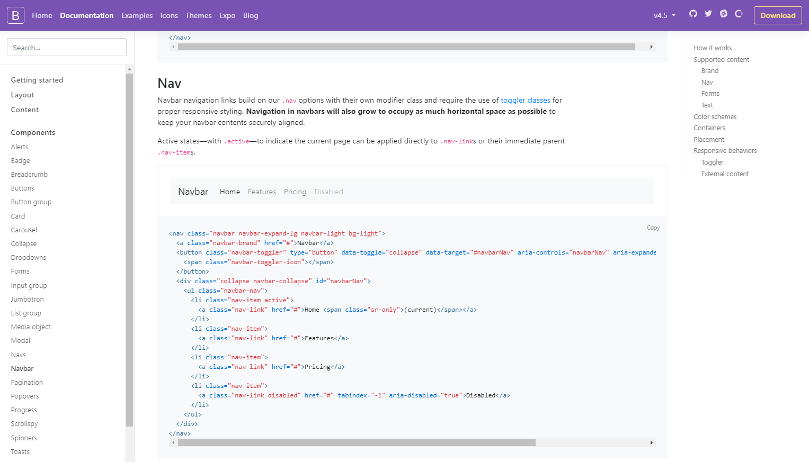
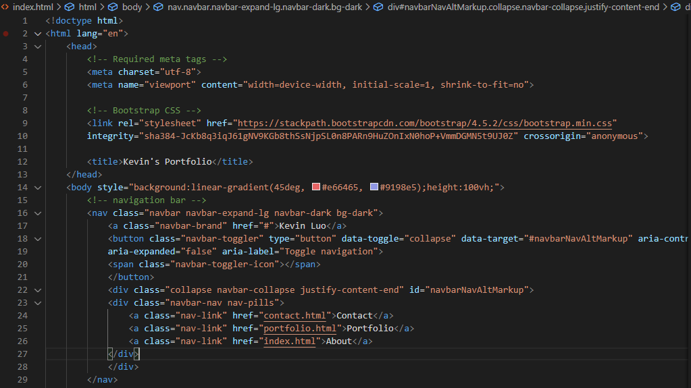

# Responsive Portfolio Using Bootstrap

## Description

A portfolio is a key element for any professional programmer - a site to showcase the highlights of your github portfolio would only benefit a programmer's search for his/her next career opportunity. In the modern technology-driven world the selection of devices with web browser capabilities continues to grow. As a result, it's increasingly important to ensure websites have responsive layouts to optimize the viewing experience for all screen sizes. 

While it's possible to create responsive sites by writing raw CSS, Bootstrap provides a convenient framework that saves you the hassle of writing the raw code and allows you to spend more time designing the overall layout of your site. A few advantages of Bootstrap include its pre-defined responsive grid system, customizable components (eg navigation bars, image carousels, etc.), and responsive image resizing. 

The screenshot below shows an example of Bootstrap's components:

## Table of Contents

* Creation Process
* Usage
* Credits
* License

## Creation Process

The first step in creating my site was adding components that would be consistent across all pages on my site. This included the navigation bar, footer, and background color. For the navigation bar, I chose a navbar component from Bootstrap and altered the href links so that they navigated to the correct pages when clicked. For theh footer, I simply added a container-fluid class with a fixed position on each HTML file. Finally, I added background linear-gradient styling to the body tags of each HTML file to standardize the background for my site.

The screenshot below shows how I linked the navigation bar buttons to the corresponding pages on my site: 

The next step was adding the content for each page on my site: portfolio, about me, and contact. For each of these pages, I added a card component from Bootstrap and utilized their grid system to organize the content within the card. For each page, the entire card itself (parent) was one row and column, with the content within the card (children) organized in nested rows and columns. The following sections delve into the process for each page.

**About Me**

The first nested row is made up of one column: an image and the first paragraph. I styled the image as float:left so that when the screen size shrank, the paragraph text would begin wrapping underneath the image. The second nested row is made up entirely of the second paragraph.

**Portfolio**

There are three nested rows within the card, with the first two rows containing two images, and the final row containing one image. I originally had each image in a given row occupying their own column, however I noticed that adding columns also added margins to the images which I couldn't figure out how to work-around. 

**Contact**

There are three nested rows within the card, with each row containing one form-group user-input section. While the contact form does not store anything yet, the main point of this was to create the form itself with responsive re-sizing.

## Usage

Please see the following link which directs you to my portfolio site. Clicking on the nagivation bar links will direct you to the corresponding pages.

* [Responsive-Portfolio Link](https://kev-luo.github.io/responsive-portfolio/)

## Credits

While there were no collaborators in this project, I relied heavily upon the Bootstrap documentation, specifically the components, layouts, and utilities sections. Links to these sections are as follows:

* [Bootstrap Components](https://getbootstrap.com/docs/4.5/components/)
* [Bootstrap Layouts](https://getbootstrap.com/docs/4.5/layout/)
* [Bootstrap Utilities](https://getbootstrap.com/docs/4.5/utilities/)

## License

© 2019 Trilogy Education Services, a 2U, Inc. brand. All Rights Reserved.

Licensed under the [MIT](https://github.com/microsoft/vscode/blob/master/LICENSE.txt) License.

